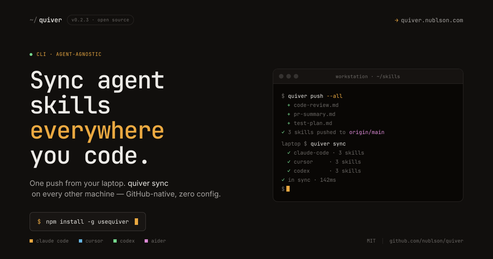

# Quiver

**Sync your AI agent skills across every machine — one push, one sync, done.**

Quiver is a CLI sync layer for the global skills your AI agents share. Install skills once, push them to a private GitHub Gist, and restore everything on any new device with a single command. No server. No new account. No proprietary backend — just your own GitHub Gist as the source of truth.

Works with every major AI coding agent: Claude Code, Cursor, Gemini CLI, GitHub Copilot, Aider, and more.

```
npm install -g usequiver
```

---

## How it works

Skills installed globally via `npx skills add -g` live in `~/.agents/.skill-lock.json`. When you move to a new machine, that file doesn't come with you. Quiver fixes that:

1. **`quiver push`** — reads your lock file and uploads it to a secret GitHub Gist
2. **`quiver sync`** — on any other machine, fetches the Gist and reinstalls every missing skill

Sync is additive only — it never removes or overwrites local skills.

---

## Quickstart

```bash
# 1. Authenticate (once, per device)
quiver login

# 2. After installing skills, push your lock file
npx skills add https://github.com/anthropics/skills --skill frontend-design -g
quiver push

# 3. On a new machine — restore everything in one shot
quiver login
quiver sync
```

---

## Commands

| Command | Description |
|---|---|
| `quiver login` | Authenticate via GitHub OAuth (device flow) |
| `quiver push` | Upload your local skill lock to a private GitHub Gist |
| `quiver sync` | Install any skills missing from the remote lock |
| `quiver status` | Preview the diff between local and remote — without changing anything |
| `quiver remove <skill>` | Remove a skill locally, fix the lock file, and push the deletion |
| `quiver whoami` | Show your authenticated GitHub user and Gist details |

---

## Design decisions

- **No Quiver server** — the CLI talks directly to the GitHub Gist API using the token obtained during `quiver login`. There is nothing to maintain server-side.
- **Agent-agnostic** — Quiver syncs whatever is in `~/.agents/.skill-lock.json`, regardless of which agents the skills target.
- **Global skills only** — project-level skill configs are out of scope. Quiver only touches the global lock file.
- **`quiver remove` fixes a known `npx skills` bug** — `npx skills rm` removes skill files but leaves stale entries in the lock file. `quiver remove` does the full cleanup.

---

## Stack

| Layer | Choice |
|---|---|
| CLI | TypeScript + oclif |
| Web + Docs | Next.js 16 + Tailwind v4 + Fumadocs |
| Storage | GitHub Gist (one secret Gist per user) |
| Auth | GitHub OAuth device flow (RFC 8628) |
| Deploy | Vercel (web) + npm (CLI) |
| Monorepo | Turborepo + pnpm workspaces |

---

## Development

```
quiver/
  apps/web/        # Next.js — marketing + docs (purely static)
  packages/cli/    # quiver CLI (oclif + TypeScript)
```

```bash
pnpm install
pnpm dev       # start all apps
pnpm build     # build everything
pnpm lint
pnpm test

# CLI only
node packages/cli/bin/run.js --help
pnpm --filter cli dev push   # run without a build step
```

**Branches:** `main` (production) · `develop` (staging) · `feature/*` / `fix/*` (work)

See [CLAUDE.md](./CLAUDE.md) for full architecture and design decisions, and [CONTRIBUTING.md](./CONTRIBUTING.md) for the Git workflow.

---

## License

MIT — [github.com/nublson/quiver](https://github.com/nublson/quiver)
